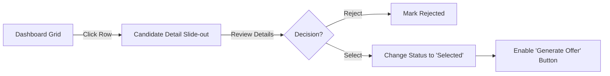

# UX Design Specification InternManagement

**Author:** Asmit
**Date:** 2026-01-16

---

<!-- UX design content will be appended sequentially through collaborative workflow steps -->

## Executive Summary

### Project Vision
To empower Hiring Managers with a "Zero-Hassle" Intern Management System that automates the tedious parts of hiring (parsing, offers) so they can focus on talent. The experience should feel like a "Command Center"—powerful, responsive, and reassuring.

### Target Users
*   **The Efficient Manager:** Values speed and accuracy above all. Low tolerance for friction.
*   **Context:** Primarily Desktop (Office work), but checks status on Mobile (Home/Commute).

### Key Design Challenges
*   **Automation Trust:** Building confidence that the "Magic Parser" didn't break anything.
*   **Action Irreversibility:** Designing "Safe" checkpoints before irrevocable actions (sending emails).
*   **Information Density:** Displaying rich candidate data (Skills, Status, Scores) without clutter.

### Design Opportunities
*   **"The Magic Drop":** A visually stunning Drag-and-Drop zone that animates parsing progress to celebrate the time saved.
*   **"Confidence UI":** Using subtle cues (green checks, success toasts) to reassure the user at every step.

## Core User Experience

### Defining Experience
The experience is defined by **Flow** and **Confidence**. The user should feel like they are "directing" looking at a dashboard, not "working" in a spreadsheet.

### Platform Strategy
*   **Web (Desktop):** Rich drag-and-drop interfaces, split-screen previews (Resume vs. Parsed Data).
*   **Mobile Web:** Read-only optimization for "On-the-go" status checks and "Emergency Approvals".

### Effortless Interactions
*   **Drag-and-Parse:** Dropping a file should instantly animate into a candidate card.
*   **One-Click Offer:** Generating a complex PDF and email draft happens in the background, presenting a "Ready to Send" state instantly.

### Critical Success Moments
*   **The "Parsed" Moment:** When the user sees the extracted data is 100% accurate without typing.
*   **The "Sent" Moment:** A satisfying confirmation animation when the offer is dispatched.

### Experience Principles
1.  **"Don't Make Me Type":** Every field should be pre-filled or selectable.
2.  **"Safe Velocity":** Fast actions, but with clear "Are you sure?" guardrails for external comms.
3.  **"Status at a Glance":** Visual indicators (colors, icons) over text labels.

## Desired Emotional Response

### Primary Emotional Goals
*   **Relief:** Replacing "Administrative Dread" with "Automated Ease".
*   **Control:** The user should feel like the pilot of a highly capable machine.
*   **Certainty:** Eliminating the "did I copy-paste that right?" anxiety.

### Emotional Journey Mapping
1.  **Ingestion:** Anticipation -> **Delight** (Visual "Magic" of parsing).
2.  **Selection:** Analytical Focus -> **Decisiveness** (Clear "Select" actions).
3.  **Action:** Responsibility -> **Accumulation** (Seeing the "Ready" queue grow).
4.  **Completion:** Closure -> **Satisfaction** (Empty queue, graphs updating).

### Micro-Emotions
*   **Trust:** "The system found the email address correctly."
*   **Safety:** "I can undo this choice before it goes out."
*   **Speed:** "That was instant."

### Design Implications
*   **"Calm" Palette:** Use a clean, professional color scheme (e.g., Deep Navy & Teal) to convey stability.
*   **Animation for Trust:** Use animation *only* to show system status (e.g., a "Processing" ring that turns into a "Checkmark").
*   **Human Tone:** Success messages should be conversational ("3 Offers Sent!", not "Job Complete").

## UX Pattern Analysis & Inspiration

### Inspiring Products Analysis
*   **TurboTax:** For making data entry "human" and linear.
*   **Trello:** For the intuitive "Status Board" mental model.
*   **Mailchimp:** For emotional design around high-anxiety actions (Sending).

### Transferable UX Patterns
*   **Split-View Verification:** (Like DocuSign) Showing the source PDF on the left and the parsed form on the right for easy verification.
*   **Action Toasts:** (Like Gmail) "Offer Sent. Undo?" to give a sense of safety.
*   **Empty States:** (Like Dropbox) "Drop files here" zones that look active and inviting, not just empty white space.

### Anti-Patterns to Avoid
*   **Infinite Scroll:** In a hiring context, pagination is better for "batches".
*   **Modal Overload:** Don't trap users in layers of popups.
*   **Hidden Actions:** Key actions (Generate, Send) must be visible, not tucked in "..." menus.

### Design Inspiration Strategy
**Adapt:** The "Mailchimp High-Five" -> A "Successful Launch" animation when offers are sent.
**Adopt:** The "Trello Board" -> For the Pipeline view.

## Design System Foundation

### 1.1 Design System Choice
**Shadcn/UI** (Tailwind CSS + Radix UI Primitives).

### Rationale for Selection
*   **Velocity:** High-quality pre-built components (Data Tables, Dialogs, Cards) perfect for a dashboard.
*   **Ownership:** Code is copied into the project, allowing full customization without fighting a library's internal styles.
*   **Accessibility:** Built on Radix UI, ensuring screen reader support and keyboard nav out of the box.

### Implementation Approach
*   **Base:** TailwindCSS for utility classes.
*   **Icons:** Lucide React (Clean, consistent line icons).
*   **Font:** **Inter** (Standard, highly readable) or **Manrope** (Modern, slightly more character).

### Customization Strategy
*   **Theme:** "Sapphire & Slate".
    *   Primary: Deep Blue/Slate (Trust).
    *   Accent: Vibrant Teal (Action/Success).
    *   Error: Soft Red (Not alarming).
*   **Radius:** Small rounded corners (0.5rem) for a professional, crisp feel.

## 2. Core User Experience (Detailed Flow)

### 2.1 Defining Experience
The **"Click-to-Ship"** Workflow. The user acts as an approver, not a data entry clerk. The system does the heavy lifting (parsing, formatting), and the user provides the final "God Mode" authorization.

### 2.2 User Mental Model
*   **Current State:** "I am a typist." (Copying data from PDF to Word).
*   **Future State:** "I am a Director." (Reviewing prepared documents and approving them).
*   **Metaphor:** "Air Traffic Control" - managing the flow of candidates through gates.

### 2.3 Success Criteria
*   **Latency:** The "Generate" click must yield a preview in < 500ms.
*   **Accuracy:** The preview must perfectly match the final PDF.
*   **Reversibility:** Users must feel they can "Abort" right up until the final second.

### 2.4 Novel UX Patterns
*   **"The Trust Anchor":** On the Review Screen, highlighting exactly *where* in the resume the data came from (e.g., hovering over "Name" highlights the name in the PDF view).

### 2.5 Experience Mechanics
1.  **Trigger:** User selects "Action: Make Offer".
2.  **State:** System enters "Draft Mode".
3.  **Preview:** Split-screen overlay.
4.  **Commit:** "Send Offer" button (requires 1s press-and-hold to prevent accidental clicks).
5.  **Outcome:** Row turns Green. Status updates to "Offered".

## Visual Design Foundation

### Color System ("Sapphire & Slate")
*   **Neutral:** Slate (Cool Grey) series from Tailwind/Shadcn.
*   **Primary (Brand):** Blue-600 (`#2563EB`) - Professional, Standard.
*   **Success (Action):** Teal-600 (`#0D9488`) - Used for "Joined" status and "Sent" toasts.
*   **Warning (Attention):** Amber-500 (`#F59E0B`) - For "Low Confidence" parsing or "Missing Info".

### Typography System
*   **Family:** **Inter** (Variable). Excellent legibility at small sizes (tables).
*   **Hierarchy:**
    *   **H1:** Semibold, Tight tracking (Page Titles).
    *   **Label:** Medium, Start-case (Form Labels).
    *   **Data:** Regular, Slate-900 (Candidate details).
    *   **Meta:** Regular, Slate-500 (Timestamps, IDs).

### Spacing & Layout Foundation
*   **Grid:** 12-column Grid for Dashboard widgets.
*   **Container:** `max-w-7xl` centered (Dashboard view).
*   **Components:**
    *   **Cards:** 1px border (`border-slate-200`), White bg, `rounded-lg`.
    *   **Inputs:** `h-10` (40px) standard height for touch targets.

## Design Direction Decision

### Design Directions Explored
We focused on a **"Modern Utility"** direction. Avoiding "flashy" consumer gradients in favor of "clean, information-dense" professional tools (Linear-style but for HR).

### Chosen Direction
**"The Slate Command Center"**
*   **Sidebar Navigation:** Dark mode sidebar for focus and separation of context.
*   **Light Content Area:** White background for maximum readability of candidate data.
*   **High-Contrast Actions:** Teal buttons for primary actions ("Generate Offer") to guide the eye.

### Design Rationale
*   **Readability:** Recruiter dashboards are data-heavy. White backgrounds with Slate text offer the best contrast for long sessions.
*   **Focus:** The dark sidebar visually "frames" the workspace, making it feel like a dedicated tool.
*   **Trust:** The color restraint (Blue/Grey/Teal) communicates "System Stability" and "Data Integrity".

### Implementation Approach
*   **Layout:** standard `Sidebar Layout` (Collapsible on mobile).
*   **Cards:** Flat styling (`shadow-sm`, `border`) to reduce visual noise when viewing 50+ items.


## User Journey Flows

### 1. The "Magic Ingestion" Flow
The user drags files to the dashboard, and they instantly populate as structured data.

```mermaid
graph TD
    A[User Drags PDF] --> B{Drop Zone}
    B -->|Valid File| C[Parsing Animation]
    B -->|Invalid| D[Show Toast Error]
    C --> E{Confidence Score}
    E -->|High (>90%)| F[Add to Grid (Ready)]
    E -->|Low (<90%)| G[Add to Grid (Needs Review)]
    F --> H[Update 'Total Candidates' Counter]
```

### 2. The "Shortlist & Offer" Flow
Moving a candidate from raw list to "Offered" status.



### 3. The "One-Click Offer" Flow
The high-stakes action of sending the offer.

```mermaid
graph TD
    A[Click 'Generate Offer'] --> B[Open Modal]
    B --> C[Background: Generate PDF]
    B --> D[Split View: PDF + Email Draft]
    D --> E{User Check}
    E -->|Edit| F[Update Fields]
    E -->|Approve| G[Hold 'Send' Button (1s)]
    G --> H[Animation: Sending...]
    H --> I[Success Toast + Close Modal]
```

### Journey Patterns
*   **Slide-outs:** For candidate details (keeps context of the main grid).
*   **Modals:** Only for the "Final Action" (Focus mode).
*   **Toasts:** For all system feedbacks (Non-blocking).

## Component Strategy

### Design System Components (Shadcn/UI)
*   **Data Table:** High density, sortable headers, row selection.
*   **Dialog/Sheet:** For "Quick Edit" sidebars.
*   **Form:** React Hook Form + Zod validation (critical for offer data).

### Custom Components

#### 1. `ResumeDropZone`
**Purpose:** Primary ingestion point.
**Anatomy:** Large dashed container, central icon (Cloud Upload), helper text.
**Interaction:** DragEnter -> Border turns Teal. Drop -> Progress Bar appears.

#### 2. `QuickReviewCard` (Mobile)
**Purpose:** Triage on the go.
**Anatomy:** Name (Bold), Status (Badge), Skills (Tags), "Review" Action (Right Chevron).
**Usage:** Replaces the Data Table on mobile viewports.

#### 3. `LiveOfferPreview`
**Purpose:** Confidence builder before sending.
**Anatomy:** Split pane. Left: Read-only PDF view. Right: Form Controls.
**Behavior:** Debounced "Regenerate" when form data changes.

### Implementation Roadmap
**Phase 1:** Core Table, DropZone, and Basic Modal.
**Phase 2:** The `LiveOfferPreview` (Complex PDF rendering).

## UX Consistency Patterns

### Button Hierarchy
*   **Primary:** Solid Teal. Used for the main *positive* action on a page.
*   **Secondary:** Outline Slate. For alternative actions (Cancel, Back).
*   **Ghost:** Transparent/Text. For tertiary actions in menus/tables.

### Feedback Patterns
*   **Loading:** Use **Skeleton Loaders** for the main table data (prevents layout shift). Use **Spinner** inside buttons for commit actions.
*   **Success:** Toasts for transient actions. Full-page "Success" state only for the end of a major wizard flow.
*   **Error:** Inline validation is mandatory for all form fields.

### Navigation Patterns
*   **Sidebar:** Permanent on Desktop. Collapsible "Drawer" on Mobile.
*   **Breadcrumbs:** Not needed (structure is flat).
*   **Tabs:** Used within the Candidate Detail view (Profile | History | Offers).

## Responsive Design & Accessibility

### Responsive Strategy
**"Desktop-First, Mobile-Companion"**
*   **Desktop:** optimized for maximum data density and multi-tasking (Split views).
*   **Mobile:** optimized for **Status Checks** and **Quick Triage**.
    *   *Transformation:* The Candidate Data Table transforms into a **Stack of Cards** on mobile.

### Breakpoints (Tailwind Defaults)
*   `sm`: 640px (Mobile Landscape)
*   `md`: 768px (Tablet) - Sidebar collapses to rail.
*   `lg`: 1024px (Laptop) - Full layout.
*   `xl`: 1280px (Desktop) - Maximum density.

### Accessibility Strategy (WCAG 2.1 AA)
*   **Contrast:** All text must be Slate-600 or darker on white.
*   **Keyboard:** Full tab navigation for all forms. "Escape" must close all modals.
*   **Semantics:** Use native HTML (`<button>`, `<table>`) instead of `div` soup to ensure screen reader support.
